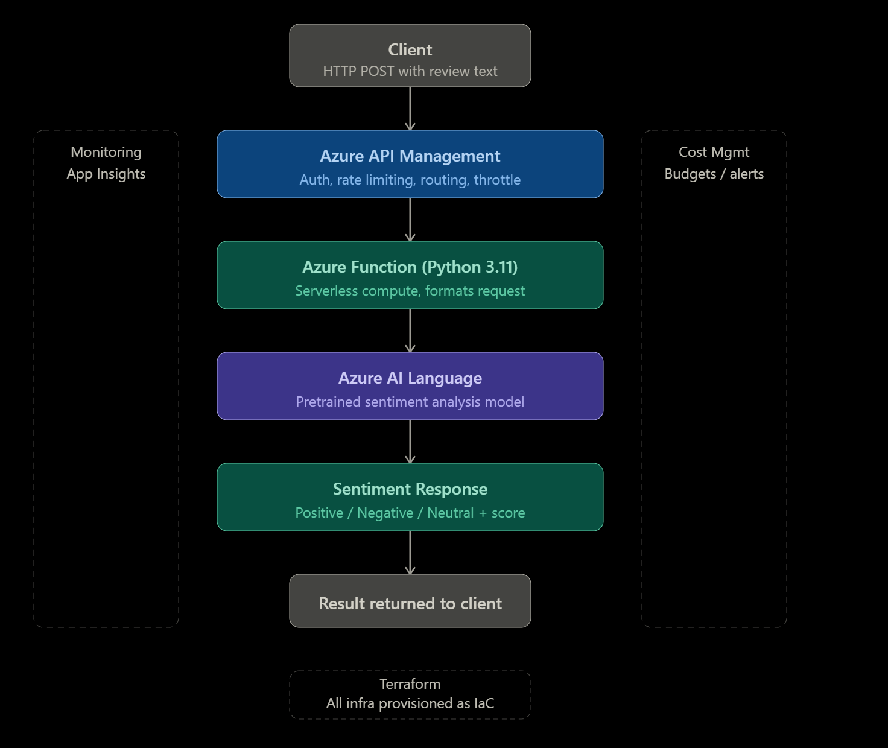

# Sentiment-Analysis-API
# Sentiment Analysis API

A serverless REST API that analyzes customer review text and returns sentiment scoring, confidence levels, and key phrases — enabling businesses to track product popularity and customer opinion at scale.

---

## What It Does

Accepts a customer review as text input and returns an overall sentiment category (positive, neutral, or negative), confidence scores, and extracted key phrases. Results can be used to identify patterns in product feedback and monitor customer satisfaction over time.

---

## Architecture



**Request flow:**

Client → Azure API Management → Azure Function → Azure AI Language → Response

---

## Technologies

**Azure Functions (Python 3.11)**
Serverless compute that runs the sentiment analysis logic. No idle compute cost — the function scales automatically with demand and requires no infrastructure management.

**Azure AI Language**
A pretrained natural language model configured to determine a customer's overall opinion and extract key phrases from review text. Using a pretrained model means the machine learning work is already done — the function consumes an endpoint rather than training a custom model, which would be out of scope for this use case.

**Azure API Management**
Sits in front of the Function App as the API gateway. Handles routing, policy enforcement, and acts as the single entry point for all API consumers.

**Azure Cost Management**
Configured with a monthly budget and alerting to monitor spend across all provisioned resources. Ensures cost visibility from day one rather than as an afterthought.

**Terraform**
All infrastructure is provisioned as code. This means the entire environment is reproducible, version controlled, and reviewable. If something breaks or needs to be rebuilt, the infrastructure can be redeployed from scratch without manual portal configuration.

---

## Usage

**Endpoint**
```
POST https://sentimentapi-apim.azure-api.net/sentiment/sentiment
```

**Request**
```bash
curl -k -X POST https://sentimentapi-apim.azure-api.net/sentiment/sentiment \
  -H "Content-Type: application/json" \
  -d '{"text": "Your review text here"}'
```

**Positive example**
```bash
curl -k -X POST https://sentimentapi-apim.azure-api.net/sentiment/sentiment \
  -H "Content-Type: application/json" \
  -d '{"text": "This product is absolutely fantastic, I love it"}'
```
```json
{
  "sentiment": "positive",
  "confidence": {"positive": 1.0, "neutral": 0.0, "negative": 0.0},
  "key_phrases": ["product"],
  "language": "en"
}
```

**Negative example**
```bash
curl -k -X POST https://sentimentapi-apim.azure-api.net/sentiment/sentiment \
  -H "Content-Type: application/json" \
  -d '{"text": "This product is terrible, I hate it and want a refund"}'
```
```json
{
  "sentiment": "negative",
  "confidence": {"positive": 0.0, "neutral": 0.0, "negative": 1.0},
  "key_phrases": ["product", "refund"],
  "language": "en"
}
```

---

## Infrastructure Notes

- APIM is provisioned on the **Consumption tier** — rate limiting via `rate-limit-by-key` is not supported at this tier and would be added on Developer tier or higher in a production environment
- Function code is deployed separately from infrastructure using the Azure Functions Core Tools CLI
- All infrastructure is managed via Terraform state — changes should be made through Terraform, not the Azure portal

---

## Project Structure

```
Sentiment Analysis API/
├── function_app/
│   ├── function_app.py       # Sentiment analysis logic
│   └── requirements.txt      # Python dependencies
└── terraform/
    ├── main.tf               # All infrastructure resources
    ├── variables.tf          # Input variables
    ├── outputs.tf            # Deployment outputs
    └── apim_policy.xml       # API Management policy
```

---

## Author

Antsys Technologies LLCServerless REST API that accepts customer review Project folder
